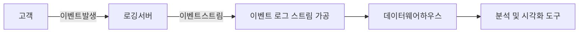

# 로깅 남기기

## 로깅이란

- 서비스를 개발하거나 운영에 필요
- 필요한 정보를 출력 매체를 통해 보여주거나 기록
- 출력한 로그를 기반으로 서비스나 시스템의 진단, 분석, 예측

## 로깅의 중요도

- 에러
- 경고
- 정보
- 디버깅
- 흔적, 추적

## 로그 기록 방법

- 콘솔
- 파일
- 이메일
- 데이터베이스

## 로깅 프레임워크

- Logback
- Log4j

## Logback의 특징

- SLF4J (Simple Logging Facade For Java) 기반의 구현체
- 5단계의 로그 레벨 지원
- 서비스나 앱으 ㅣ운영 환경에 따라 별도로 로그 설정 적용 가능
- log4j보다 뛰어난 성능, 필터링, 로그레벨 변경 등의 향상
- 기본적으로 spring-boot-starter-web에 포함
- 서버를 재시작하지 않고도 설정 변경 가능
- 압축 지원
- 보관 기간 관리 가능

## Logback 아키텍처

- Logger
  - 로그 메세지 생성 관련 클래스
- Appender
  - 로그를 출력할 대상 클래스
  - 로거가 로깅 이벤트를 전달
  - 실제 로깅 작업 담당
- 로그 포맷 관련한 클래스
- 패턴을 통한 로깅 메세지 형식 지정

### 로깅 레벨

TRACE < DEBUG < INFO < WARN < ERROR

## Logback 로깅 방법

- 로그를 어떤 방법으로 남길지 설정 가능
- Logback의 5가지 로깅 방법
  - **ConsoleAppender**
  - FileAppender
  - **RollingFileAppender**
  - SMTPAppender
  - DBAppender

## Logback 적용

- 스프링부트에서 2가지 설정 방법
  - application.yml 또는
    - `logging.level.root: warn`
    - `logging.level.org.springframework.web: debug`
    - `logging.level.org.springframework.hibernate: error`
  - logback-spring.xml에 설정

### Logback 로그 설정

- 클래스 패스 위체에 있어야 함
- 리소스 폴더에 생성 (src/main/resources)
- 설정 파일명
  - logback-spring.xml
  - logback-spring.groovy

## 예제

```xml
<?xml version=1.0" encoding="utf-8" ?>
<configuration>
	<!-- 설정: 로깅 파일 위치 -->
	<property name="LOG_ROOT" value="./logs" />
	<!-- 설정: 로깅 파일명 -->
	<property name="LOG_FILE_NAME" value="hello-logback" />

	<!-- 콘솔 파일 Appender -->
	<appender name="STDOUT" class="ch.qos.logback.core.consoleAppender">
		<encoder>
			<pattern>%d{HH:mm:ss.SSS} [%thread] %-5level %logger{36} - %msg%n</pattern>
		</encoder>
	</appender>

	<!-- 롤링 파일 Appender -->
	<appender name="FILE" class="ch.qos.logback.core.RollingFileAppender">
		<file>${LOG_ROOT}/%{LOG_FILE_NAME}</file>
		<rollingPolicy class="ch.qos.logback.core.rolling.TimeBasedRollingPolicy">
			<fileNamePattern>${LOG_ROOT}/${LOG_FILE_NAME}.%d{yyyy-mm-dd_hh:mm}.log</fileNamePattern>
			<maxHistory>30</maxHistory>
			<maxHistory>3GB</maxHistory>
		</rollingPolicy>
		<encoder>
			<pattern>%d{HH:mm:ss.SSS} [%thread] %-5level %logger{36} - %msg%n</pattern>
		</encoder>
	</appender>

	<springProfile name="local">
		<root level="debug">
			<appender-ref ref="STDOUT"/>
		</root>
	</springProfile>

	<springProfile name="dev">
		<root level="debug">
			<appender-ref ref="STDOUT"/>
			<appender-ref ref="FILE"/>
		</root>
	</springProfile>

	<springProfile name="staging | prod | production">
		<root level="debug">
			<appender-ref ref="STDOUT"/>
		</root>
	</springProfile>
</configuration>
```

## 실전 Tips

1. 로깅은 로그백
2. 스프링 부트 설정 파일 또는 로그백 설정
3. 스프링 프로파일에 맞춰 로깅 설정
4. 개발에는 ConsoleAppender와 DEBUG
5. 상용에는 RollingFileAppender와 INFO

# 로깅 수집하기

## 로깅 수집이란

- 서비스나 시스템에서 발생한 이벤트
- 이벤트를 전송하거나 기록
- 전송되거나 기록된 이벤트 데이터를 가공
- 가공된 로그를 로그 저장소에 적재

## 로깅 수집의 방법

- 이벤트 발생 후 전송된 메세지를 **수신**
- 이벤트 발생 후 기록된 자료를 **동기화**
- 이벤트 발생 후 기록된 로그를 **Pull 또는 Push**

## 로깅 수집 도구들

- Filebeat
  - 경량 로그 수집기
  - 모니터링 시스템에 설치
  - 수집 대상 지정
  - 로그 데이터 파싱
  - 전송
    - Logstash
    - Elasticsearch
- Fluentd
  - 범용적인 로그 수집기
  - JSON 구조 - 쉽고, 구조화 됨
  - 500개 이상의 다양한 플러그인
  - 아주 적은 시스템 리소스 사용
  - 데이터 손실 방지
    - 버퍼링 지원
- Promtail
  - 로그 수집기
  - Grafana Loki

### 로그 처리 세트 아이템

- ELK
  - Elasticsearch, Logstash, Kibana
- EFK
  - Elasticsearch, Fluentd, Kibana
- Grafana + Loki

### 로그 수집된 이후

- 수집된 로그를 전송
- 전송된 로그를 적재
- 적재된 로그를 활용


# 로깅 조회하기

## 로그 조회

- 서비스나 이벤트에서 발생한 로그를 검색
- 검색 조건
  - When
  - Where
  - What
  - 로그 등급

## 로그 조회 도구

- 터미널 (제외)
- Elasticsearch + Kibana
- Loki + Grafana

## 로그 조회 도구 특징

- **Elasticsearch + Kibana**
  - Full-text 검색 가능
  - 다양한 검색 조건 가능
  - KQL을 통한 조회 - 학습 곡성
    - Kibana Query Language
    - 다양한 예제나 학습 정보
  - Kibana 풍부한 시각화가 가능
  - 유지 비용이 상대적으로 높다.
  - 시장에서 오래 사용되고 있음
- Loki + Grafana
  - 모니터링과 로그 검색이 가능하다는 장점
  - 데이터 소스별 인덱싱 지원
    - 작고, 매우 빠름
  - LogQL을 통한 조회 - 학습 곡성
    - Log Query Language
  - Grafana에서 통합 사용
  - 시계열 데이터에 특화
  - 유지 비용이 상대적으로 낮다.

## 로그 검색 필수 조건

- 어디서 로그가 발생했나?
  - 역할(Role) - 주문, 결제, 배송
- 언제 로그가 발생했나?
  - 시간 범위, 보관 기한 중요
- 로그 레벨은?
  - 5단계 로그 레벨
- 어떤 어플리케이션에서 발생했나?
  - nginx, springboot, nodejs, djang, …
- 기타 키워드

# 확장성 있는 로깅 설계

## 확장성 있는 로깅을 위한 가이드

- 로깅 레벨을 판단하는 기준을 만든다.
- 구조화된 로깅 (Pliain Text → JSON or XML)
- 맥락을 담은 로깅 (Context)
  - 누가 요청했나? 어디서 요청했나? 무엇을 요청했나? 언제 요청했나?
- 민감 정보를 담지 않아야 함 (개인정보, 시스템 비밀번호)
- 영어로 로깅을 남기도록 노력한다.
- 사람이 읽을 수 있어야 한다.

## 로깅 방법의 분류

### 도메인 서버의 직접 파일 로깅

- 정의
  - 로깅 프레임워크를 이용한 로깅 - logback
  - 개발과 디버깅 목적
  - 서비스 운영 관련 정보 확인 및 수집 목적
  - 서비스 오류 및 이상 알림
- 특징
  - 좋은 로깅을 남길 수 있는 시작점
  - 유실될 수 있음
  - 주로 사람이 직접 읽음
  - 서비스 초기 - 개발 목적
  - 서비스 런칭 후 - 운영 및 오류 추적
  - 다른 사람이 읽을 가능성이 큼
- 흐름
  - 파일 로깅 이외의 추가적인 시스템 필요
  - 로깅 수집
  - 로깅 조회
  ```mermaid
  flowchart LR
  도메인서버-->파일로깅-->로그수집-->클라우드저장소-->로그조회서버
  ```

### 도메인 서버의 데이터베이스 로깅

- 정의
  - 변경 이력 기록 및 추적 목적의 로깅
  - 중요한 정보에 대한 기록 및 이력
    - 고객 정보 변경
    - 상품 정보 변경
    - 판매자 정보 변경
    - 수수로 정보 변경
    - 결제 수단 변경
- 특징
  - 유실을 가정하지 않음 - 트랜잭션
  - 파일 로깅이나 원격 로깅에 비해 로깅의 양이 적음
  - 원본 정보의 변경에 대한 이력
  - 많은 양을 쌓을 수 없어 테이블 파티션 전략 필요
    - 범위, 목록, 키, 해시
    - 일반적인 전략 - 연도별
- 흐름
  - 별도의 로깅 시스템이 아닌 데이터베이스에 기록
  ```mermaid
  flowchart LR
  데이터베이스[(도메인 데이터베이스)]
  원격지데이터베이스[(원격지 통합 도메인 데이터베이스)]
  도메인서버-->|로깅|데이터베이스-->|복제|원격지데이터베이스
  ```
- 도메인 서버의 데이터베이스 일반적인 로깅 구조
  - 원본 테이블 변경 기록용 테이블

### 도메인 서버의 원격 로깅

- 원격 로깅 전용 서버
  - 솔루션 사용
  - 직접 구현
- 원격 로깅 방법
  - HTTP 메서드: POST
  - 데이터타입: JSON, XML

### 원격 로깅 특징

- 고객의 행동을 분석하는 목적이 크다
  - 클릭, 뷰, 고객 여정, 머무는 시간
- 일부 유실을 가정
- 엄청난 양의 데이터가 생성되는 것을 가정
- 빠르게 수집하고 분석(고속)
- 원격 로깅으로 인한 타 시스템의 영향을 주지 않아야 함

### 원격 로깅 구조

- 공통 정보
  - 클라이언트 정보
- 로깅 구조 관련 메타 정보
  - 로깅 구조 관리
- 로깅 데이터
  - 이벤트 유형 - 클릭, 노출, 속도, 에러
  - 이벤트 데이터
- 확장 데이터
  - 각 도메인이 추가로 필요한 정보

### 원격 로깅 흐름

- 원격지 로깅 서버 필요
- 고속 처리를 위한 메세징 플랫폼 활용
- 대용량 로깅 저장소 필요


# 웹로깅 시스템 만들기

## 웹로깅 시스템이란?

- 고객으로부터 발생하는 이벤트를 수집
- 이벤트 소스
  - 모바일 환경 - 안드로이드, 아이폰, 기타 기기(POS)
  - PC 환경 - 웹 브라우저

## 고객 이벤트

### 고객(클라이언트) 이벤트 종류

- 클릭
- 노출
- 시간

## 웹로깅 시스템 흐름

1. 이벤트 발생
2. 이벤트 가공
3. 데이터 웨어하우스에 적재
4. 분석 및 시각화

- 결국은 ETL
  - 추출(Extract)
  - 변환(Transform)
  - 로드(Load)



## 웹로깅 시스템 구성

- 이벤트 로그 수집
  - 실시간(준실시간)
  - 데이터 포맷(JSON → Parquet), 용량
- 이벤트 로그 가공
  - 데이터 카달로그
- 이벤트 로그 적재
  - 대형 중앙 집중식 리포지토리(데이터 웨어하우스)
- 로그 조회 및 분석
  - 분석 및 시각화 도구

## 웹로깅 시스템 도구 사례

직접 구축 vs 클라우드의 서비스를 활용

- 고객 이벤트 로그 수집
  - Amazon Kinesis Data Firehose
  - 안정적으로 실시간 스트림을 데이터 레이크, 웨어하우스, 분석 서비스에 로드
- 고객 이벤트 로그 가공
  - AWS Glue
    - 데이터 통합 서비스
    - 여러 소스의 데이터를 쉽게 검색, 준비, 이동, 통합할 수 있도록 하는 서버리스
- 고객 이벤트 로그 적재
  - Amazon Redshift
    - 클라우드 데이터 웨어하우징
  - S3
    - 확장 가능한 데이터 스토리지
- 고객 이벤트 로그 조회 및 분석
  - AWS Athena (like Google Big Query)
    - 대용량 파일 시스템(S3)를 조회
    - 필요한 만큼 데이터를 분석하고 돈을 지불한다는 장점

## 웹로깅 시스템 응용

- ABTest
- 기능 플래그
- 트래픽 조절기
