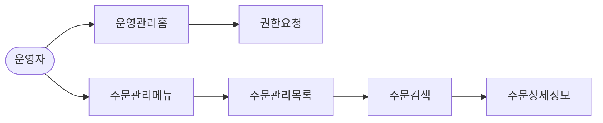
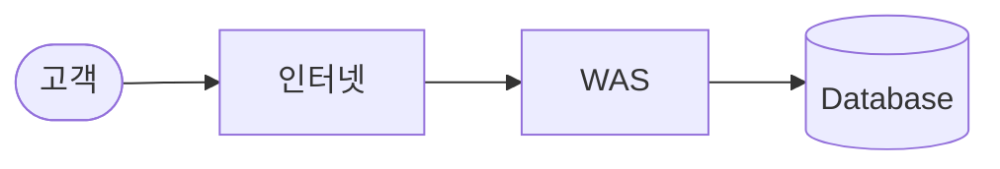

## 아이디어 시각화하기

### 아이디어를 표현하는 방법

- 제품 또는 서비스 모양 그려보기
  - 냅킨, 노트, 연습장, 화이트 보드
- 서비스 흐름 그려보기
  - UML - 플로우차트(FlowChart)
- 상태 전이를 그려보기
  - UML - 상태 다이어그램
- 누가 사용자 또는 고객인가?
  - 유즈 케이스
  - 액터 정의
  - 액터별 사용자 니즈 파악

### 아이디어를 서비스 수준으로 구체화

- 고객 시나리오
  - 고객의 전체 여정
  - 시작부터 끝까지 그려보기
  - 다양한 시나리오 그려보기
- MVP(Minimum Viable Product)
  - 린 스타트업의 개념 - 아이디어를 빠르게 제품화하고 고객의 피드백을 반영해 지속적으로 제품을 개선해나가는 방법
  - Minimum Viable Product
  - Minimum Valuable Product
  - 최소 기능 제품 또는 최소 실행 가능 제품
  - 최소의 노력, 최소의 공수
  - 가설 고객 테스트
- PRD(Product Requiredment Document) : 요구사항 문서
  - 요구사항과 이에 대한 효과를 표현하는 방법
    - 배경
    - 목표
    - 사용자 스토리
    - UX 원칙
    - 주요 지표
    - 개발 계획
    - FAQ
- 1 Pager - PRD를 종이 한 장에 표현
  - 목적
  - 배경
  - 고객은 왜 우리를 고용했는가?
  - 원칙
  - 주요 지표
  - 개발 계획
  - FAQ
- 보도 자료 포맷
  - 자신의 서비스가 신문이나 뉴스에 TV에 나오는 것을 가정
  - 제목, 부제목, 새로운 기능 등 세부적인 내용, 고객이 받을 수 있는 혜택, 담당 책임자의 말
- 3 Whys
  - 왜 고객은 이 기능을 사용해야 하는가?
  - 왜 고객은 이 서비스를 사용해야 하는가?
  - 왜 고객은 이 제품을 사용해야 하는가?
  - 목적, 대의, 신념, 방향
  - 문제의 핵심에 도달

## 아이디어 시각화 기본 도구

- 오프라인 도구
  - 냅킨
  - 포스트잇
  - 노트 또는 메모장
  - 화이트 보드
- 온라인 도구
  - 파워포인트
  - 엑셀
  - Balsamiq
  - Figma
  - **Lucid Chart**
  - **Mermaid**

자신의 생각을 표현하는 방법은 다양하다.

도구가 생각을 방해하면 안됨 (단순한것!)

편집이 생각을 방해하면 안됨. (선 기록, 후 편집)

## 추천 아이디어 시각화 방법

1. 오프라인 도구로 생각을 모으고 정리
   - 메모장
   - **포스트잇**
   - **화이트보드**
   - 종이 프로토타이핑
2. 온라인으로 표현
   - 루시드 차트
   - 머메이드

## 아이디어 시각화 도구

## 루시드 차트

- UML
- 객체 관계, 객체 상호 작용
- 도메인 분석 및 설계, 업무 분석, 시스템 분석
- 상태 전이
- 협업과 공유
- **다른 도구와 통합**

### 루시드 차트 주요 기능

- 기본 도형 및 UML 기반
  - 도메인 분석, 절차 구성, 플로우 차트, 상태, ERD
- 아키텍처 설계
  - 클라우드 설계(AWS, Azure, GCP), 네트워크
- 마인드 맵
- 조직 구성도
- 공유 및 협업
- 내보내기
- 그 외 수많은 템플릿

### 제공 템플릿

- 기본 도형
- 플로우 차트
- 클래스 다이어그램
- 시퀸스 다이어그램
- 상태 다이어그램(State/Activity)
- 유스케이스
- ERD

### 시스템 구성도 템플릿

### 사이트 맵

- 웹서비스 맵
- 모바일 앱 서비스 맵
- **타사 벤치마킹**

## 머메이드

현재 업무에서 다른 도구에 통합하여 활용하는 시각화 도구

- **플로우 차트**
  - 플로우 차트 기본 문법
    - 기본 문법
      - flowchart
      - 방향
      - 화살표
      - 노드
    - 차트 방향
      - TB - top to bottom
      - TD - top-down / same as top to bottom
      - BT - bottom to top
      - RL - right to left
      - LR - left to right
  - 플로우 차트 노드의 모양
    ```mermaid

    flowchart TB
    	id1[상자 안의 글자들]
    	id2([상자 안의 글자들])
    	id3[(Database)]
    	id4((원 안의 글자들))
    ```
    ```flow
    // 네모
    flowchart LR
    	id1(상자 안의 글자들)
    // 타원
    flowchart LR
    	id1([상자 안의 글자들])
    // 데이터베이스
    flowchart LR
    	id1[(Database)]
    // 원
    flowchart LR
    	id1((원 안의 글자들))
    ```
- **시퀸스 다이어그램**
  - 기본문법
    - sequenceDiagram
    - 화살표
      - ->>
      - -->>
      - --)
    - 메시지
  - 예제
    ```mermaid
    sequenceDiagram
    	소닉 ->> 아트: 안녕하세요.
    	아트 ->> 소닉: 네. 반갑습니다.
    	럭키 ->> 아트: 실례합니다.
    	포비 --) 럭키: 잠시만요.
    	브로디 ->> 포비: 점심 드셨어요?

    ```
  - 예제 with Actor
    ```
    sequenceDiagram
    	actor 소닉
    	actor 아트
    	actor 럭키
    	actor 포비
    	acotr 브로디
    	소닉 ->> 아트: 안녕하세요.
    	아트 ->> 소닉: 네. 반갑습니다.
    	럭키 ->> 아트: 실례합니다.
    	포비 --) 럭키: 잠시만요
    	브로디 ->> 포비: 점심 드셨어요?
    ```
- 상태 다이어그램
  ```mermaid
  stateDiagram-v2
  	[*] --> 대기
  	대기 --> [*]
  	대기 --> 배송시작
  	배송시작 --> 대기
  	배송시작 --> 직접수령
  	직접수령 --> [*]
  ```
- 파이차트
  ```mermaid
  pie title 점심에 먹은 빵의 개수
  	"소닉": 60
  	"아트": 20
  	"럭키": 15
  	"포비": 5
  	"브로디": 5
  ```
- **다른 도구와 통합**
  - 노션
  - 깃허브

### 머메이드 라이브 에디터

[https://mermaid.live/edit#pako:eNpVjk2Lg0AMhv9KyGkL9Q94WGh1t5fCFurN6SFo7AztfDBGpKj_fcd62c0pvM_zhkzY-JYxx-7px0ZTFKhK5SDNoS50NL1Y6m-QZZ_ziQWsd_ya4fhx8tBrH4Jx993mH1cJium8agyijXssGyre_R_HM5T1mYL4cPtLqtHP8FWbi07n_xMdObW-647yjrKGIhQU3wru0XK0ZNr0_rQmCkWzZYV5WlvuaHiKQuWWpNIg_vpyDeYSB97jEFoSLg3dI9ktXH4B_cJWqw](https://mermaid.live/edit#pako:eNpVjk2Lg0AMhv9KyGkL9Q94WGh1t5fCFurN6SFo7AztfDBGpKj_fcd62c0pvM_zhkzY-JYxx-7px0ZTFKhK5SDNoS50NL1Y6m-QZZ_ziQWsd_ya4fhx8tBrH4Jx993mH1cJium8agyijXssGyre_R_HM5T1mYL4cPtLqtHP8FWbi07n_xMdObW-647yjrKGIhQU3wru0XK0ZNr0_rQmCkWzZYV5WlvuaHiKQuWWpNIg_vpyDeYSB97jEFoSLg3dI9ktXH4B_cJWqw)

## 이커머스 서비스 흐름 정의하기

### 구매자 서비스 흐름

1. 구매자 유저스토리
   - 검색
     1. 구매자는 이커머스 홈페이지에 접속한다.
     2. 구매자는 검색 기능을 이용해 상품을 검색한다
     3. 구매자는 검색 결과에서 맘에 드는 상품을 선택한다
   - 탐색
     1. 구매자는 이커머스 홈페이지에 접속한다.
     2. 구매자는 메뉴 목록을 클릭한다.
     3. 구매자는 메뉴 상품 목록에서 맘에 드는 상품을 선택한다.
2. 구매자 플로우 차트 - 화이트 보드
3. 구매자 플로우 차트 - 루시드 차트

### 판매자 서비스 흐름

1. 판매자 유저스토리
   - 온보딩(입점)
     1. 판매자는 가입을 위해 판매자 홈페이지에 접속한다.
     2. 판매자는 판매자 회원 가입을 한다.
     3. 판매자는 판매 정보와 정산 계좌 정보를 등록한다
   - 판매 등록
     1. 판매자는 상품 관리 홈에 접속한다.
     2. 판매자는 신규 상품 등록을 한다.
     3. 판매자는 등록된 상품 목록을 볼 수 있다.
2. 판매자 플로우 차트

   ```mermaid
   flowchart LR
   A([판매자])
   B[판매자 정보\n 정산 정보 등록]
   A-->판매자홈-->회원가입-->B
   A-->판매자홈-->상품관리-->신규상품등록-->상품목록
   ```

## 운영자 서비스 흐름

### 운영자 유저스토리

- 운영자 등록
  1. 운영자는 운영툴에 접속할 수 있다.
  2. 운영자는 특정 운영 기능(주문)의 권한을 얻을 수 있다
     - 액터 도출 - 관리자
- 서비스 운영
  1. 운영자는 주문 관리 메뉴에 접속할 수 있다.
  2. 운영자는 주문 목록을 볼 수 있다.
  3. 운영자는 검색 조건으로 주문을 검색 할 수 있다.
     - 검색 필터
  4. 운영자는 주문 상세 정보를 볼 수 있다.

### 운영자 플로우차트



## 이커머스 시스템 설계

### 시스템 설계시 고려해야 할 점

- 목적 - 왜 필요한지
- 시간 - 프로젝트 마감 기한
- 인력
- 비용
- 확장성 - 고객 규모에 따라서 확장성 고려
- 기타

→ 단순하게 설계해야함

## 이커머스 고객 시스템 설계

### 이커머스 고객 서비스 기능

- 홈
- 검색
- 탐색
- 상품 상세
- 장바구니
- 결제
- 마이페이지

### 시스템 설계도


## 이커머스 판매자 시스템 설계

### 이커머스 판매자 서비스 기능

- 판매자 홈
- 판매 상품 목록
- 판매 상품 상세
- 정산
- 판매자 정보

### 시스템 설계도



## 운영자 시스템 설계

### 운영자 서비스 기능

일반적으로 “어드민”, “백오피스”라는 용어로 사용됨

- 운영자 홈
- 판매 상품 목록
- 판매 상품 상세
- 주문 목록
- 주문 상세
- 정산
- 운영자 정보

### 시스템 구성도


