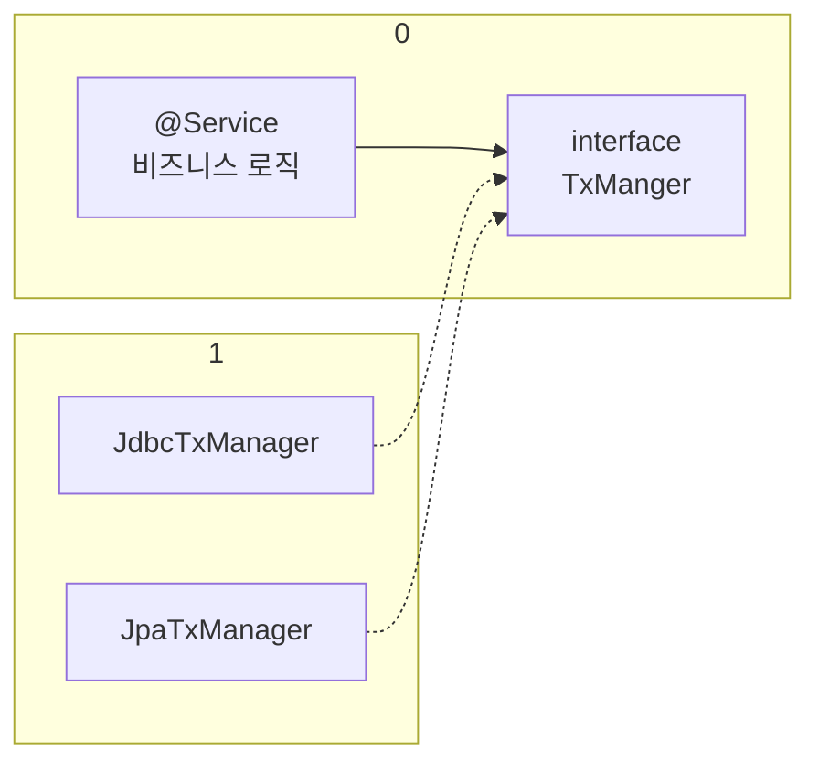
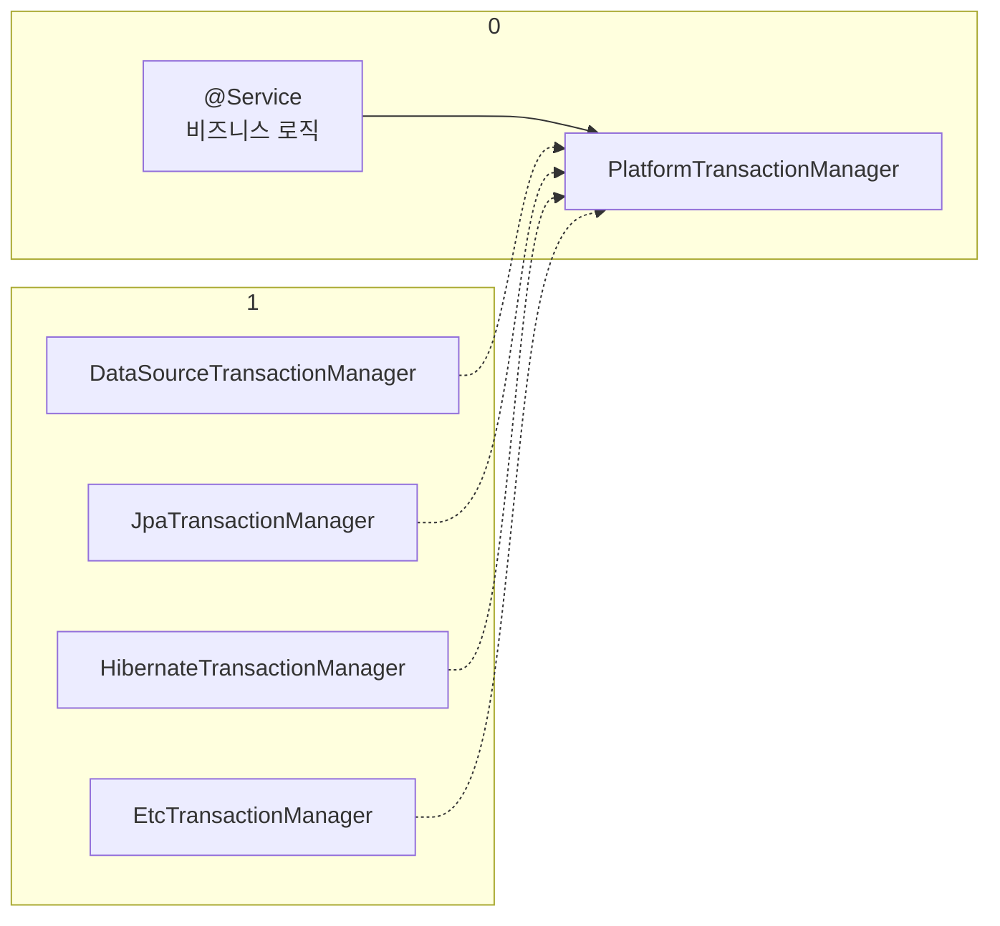

### 애플리케이션 구조

여러가지 애플리케이션 구조가 있지만, 가장 단순하면서 많이 사용하는 방법은 레이어드 아키텍처에 따라 역할에 따라 3가지 계층으로 나누는 것이다.

- 프레젠테이션 계층
  - UI와 관련된 처리 담당
  - 웹 요청과 응답
  - 사용자 요청을 검증
  - 주 사용 기술: 서블릿과 HTTP 같은 웹 기술, 스프링 MVC
- 서비스 계층
  - 비즈니스 로직을 담당
  - 주 사용 기술 : 가급적 특정 기술에 의존하지 않고, 순수 자바 코드로 작성
- 데이터 접근 계층
  - 실제 데이터베이스에 접근하는 코드
  - 주 사용 기술 : JDBC, JPA, File, Redis, Mongo …

### 순수한 서비스 계층

- 가장 중요한 곳은 서비스 계층. 프레젠테이션 계층이 바뀌고, 데이터 접근 계층을 다른 기술로 변경해도, 비즈니스 로직은 최대한 변경없이 유지되어야 함
- 이렇게 하려면 서비스 계층은 특정 기술에 종속적이지 않게 개발해야 한다.
  - 레이어드 아키텍처를 사용하는 이유도 서비스 계층을 순수하게 유지하기 위한 목적이 크다. 기술에 종속적인 부분은 프레젠테이션 계층. 데이터 접근 계층에서 가지고 간다.
  - 프레젠테이션 계층은 클라이언트가 접근하는 UI와 관련된 기술인 웹, 서블릿, HTTP와 관련된 부분을 담당해준다. 그래서 서비스 계층을 이런 UI와 관련된 기술로부터 보호해준다. 예를 들어서 HTTP API 를 사용하다가 GRPC 같은 기술로 변경해도 프레젠테이션 계층의 코드만 변경하고, 서비스 계층은 변경하지 않아도 된다.
  - 데이터 접근 계층은 데이터를 저장하고 관리하는 기술을 담당해준다. 그래서 JDBC, JPA와 같은 구체적인 데이터 접근 기술로부터 서비스 계층을 보호해준다. 예를 들어서 JDBC를 사용하다가 JPA 로 변경해도 서비스 계층은 변경하지 않아도 된다. 물론 서비스 계층에서 데이터 접근 계층을 직접 접근하는 것이 아니라, 인터페이스를 제공하고 서비스 계층은 이 인터페이스에 의존하는 것이 좋다. 그래야 서비스 코드의 변경 없이 `JdbcRepository` 를 `JpaRepository` 로 변경할 수 있다.
- 서비스 계층이 특정 기술에 종속되지 않기 때문에 비즈니스 로직을 유지보수 하기도 쉽고, 테스트 하기도 쉽다
- 정리하자면 서비스 계층은 가급적 비즈니스 로직만 구현하고 특정 구현 기술에 직접 의존해서는 안된다. 이렇게 하면 향후 구현 기술이 변경될 때 변경의 영향 범위를 최소화할 수 있음.

### 문제점들

`MemberServiceV1`

```java
package hello.jdbc.service;

import hello.jdbc.domain.Member;
import hello.jdbc.repository.MemberRepositoryV1;
import lombok.RequiredArgsConstructor;

import java.sql.SQLException;

@RequiredArgsConstructor
public class MemberServiceV1 {

    private final MemberRepositoryV1 memberRepository;

    public void accountTransfer(String fromId, String toId, int money) throws SQLException {
        Member fromMember = memberRepository.findById(fromId);
        Member toMember = memberRepository.findById(toId);

        memberRepository.update(fromId, fromMember.getMoney() - money);
        memberRepository.update(toId, toMember.getMoney() + money);
    }
}
```

- 특징
  - `MemberServiceV1` 은 특정 기술에 종속적이지 않고, 순수한 비즈니스 로직만 존재함
  - 특정 기술과 관련된 코드가 없어서 코드가 깔끔하고, 유지보수 하기 쉽다.
  - 향후 비즈니스 로직의 변경이 필요하면 이 부분을 변경하면 된다.
- 문제점
  - `SQLException` 이라는 JDBC 기술에 의존
  - 이 부분은 `memberRepository`에서 올라오는 예외이기 때문에 `memberRepository`에서 해결해야 한다.
  - `MemberRepsitoryV1`이라는 구체 클래스에 직접 의존하고 있다. `MemberRepository` 인터페이스를 도입하면 향후 `MemberService` 의 코드의 변경 없이 다른 구현 기술로 손쉽게 변경할 수 있다.

`MemberServiceV2`

```java
package hello.jdbc.service;

import hello.jdbc.domain.Member;
import hello.jdbc.repository.MemberRepositoryV2;
import lombok.RequiredArgsConstructor;
import lombok.extern.slf4j.Slf4j;

import javax.sql.DataSource;
import java.sql.Connection;
import java.sql.SQLException;

/**
 * 트랜잭션 - 파라미터 연동, 풀을 고려한 종료
 */
@Slf4j
@RequiredArgsConstructor
public class MemberServiceV2 {

    private final DataSource dataSource;
    private final MemberRepositoryV2 memberRepository;

    public void accountTransfer(String fromId, String toId, int money) throws SQLException {
        Connection con = dataSource.getConnection();
        try {
            con.setAutoCommit(false);   //트랜잭션 시작
            //비즈니스 로직
            bizLogic(fromId, toId, money, con);
            con.commit(); // 성공시 커밋
        } catch (Exception e) {
            con.rollback(); //실패시 롤백
            throw new IllegalStateException(e);
        } finally {
            release(con);
        }

    }

    private void bizLogic(String fromId, String toId, int money, Connection con) throws SQLException {
        Member fromMember = memberRepository.findById(con, fromId);
        Member toMember = memberRepository.findById(con, toId);

        memberRepository.update(con, fromId, fromMember.getMoney() - money);
        validation(toMember);
        memberRepository.update(con, toId, toMember.getMoney() + money);
    }

    private void release(Connection con) {
        if (con == null)
            return;
        try {
            con.setAutoCommit(true); // 커넥션 풀 고려
            con.close();
        } catch (Exception e) {
            log.info("error", e);
        }
    }

    private void validation(Member toMember) {
        if (toMember.getMemberId().equals("ex"))
            throw new IllegalStateException("이체중 예외발생");
    }
}
```

- 문제점
  - 트랜잭션은 비즈니스 로직이 있는 서비스 계층에서 시작하는 것이 좋다.
  - 그런데 문제는 트랜잭션을 사용하기 위해서 `javax.sql.DataSource`, `java.sql.Connection,` `java.sql.SQLException` 같은 JDBC 기술에 의존해야 한다는 점이다.
  - 트랜잭션을 사용하기 위해 JDBC 기술에 의존한다. 결과적으로 비즈니스 로직보다 JDBC를 사용해서 트랜잭션을 처리하는 코드가 더 많다.
  - 향후 JDBC에서 JPA같은 다른 기술로 바꾸어 사용하게 되면 서비스 코드도 모두 함께 변경해야 한다.
  - 핵심 비즈니스 로직과 JDBC 기술이 썪여 잇어서 유지보수 하기 어렵다.

### 문제정리

- 트랜잭션 문제
- 예외 누수 문제
- JDBC 반복 문제

- **트랜잭션 문제**
  - JDBC 구현 기술이 서비스 계층에 누수되는 문제
    - 트랜잭션을 적용하기 위해 JDBC 구현 기술이 서비스 계층에 누수되었다.
    - 서비스 계층은 순수해야 함 → 구현 기술을 변경해도 서비스 계층 코드는 최대한 유지할 수 있어야 한다.
      - 그래서 데이터 접근 계층에 JDBC 코드를 다 몰아두는 것
      - 물론 데이터 접근 계층의 구현 기술이 변경될 수도 있으니 데이터 접근 계층은 인터페이스를 제공하는 것이 좋다.
    - 서비스 계층은 특정 기술에 종속되지 않아야 한다. 지금까지 그렇게 노력해서 데이터 접근 계층으로 JDBC 관련 코드를 모았는데, 트랜잭션을 적용하면서 결국 서비스 계층에 JDBC 구현 기술의 누수가 발생했다.
  - 트랜잭션 동기화 문제
    - 같은 트랜잭션을 유지하기 위해 커넥션을 파라미터로 넘겨야 함
    - 이때 파생되는 문제들도 있다. 똑같은 기능도 트랜잭션용 기능과 트랜잭션을 유지하지 않아도 되는 기능으로 분리해야 한다.
  - 트랜잭션 적용 반복 문제
    - 트랜잭션 적용 코드를 보면 반복이 많다. try , catch , finally ...
- **예외 누수**
  - 데이터 접근 계층의 JDBC 구현 기술 예외가 서비스 계층으로 전파된다.
  - `SQLException` 은 체크 예외이기 때문에 데이터 접근 계층을 호출한 서비스 계층에서 해당 예외를 잡아서 처리하거나 명시적으로 `throws` 를 통해서 다시 밖으로 던져야한다.
  - `SQLException` 은 JDBC 전용 기술이다. 향후 JPA나 다른 데이터 접근 기술을 사용하면, 그에 맞는 다른 예외로 변경해야 하고, 결국 서비스 코드도 수정해야 한다.
- **JDBC 반복 문제**
  - 지금까지 작성한 MemberRepository 코드는 순수한 JDBC를 사용했다.
    - 이 코드들은 유사한 코드의 반복이 너무 많다.
      - try , catch , finally ...
      - 커넥션을 열고, PreparedStatement 를 사용하고, 결과를 매핑하고... 실행하고, 커넥션과 리소스를 정리한다.

**스프링과 문제 해결**

스프링은 서비스 계층을 순수하게 유지하면서, 지금까지 이야기한 문제들을 해결할 수 있는 다양한 방법과 기술들을 제공한다.
지금부터 스프링을 사용해서 우리 애플리케이션이 가진 문제들을 하나씩 해결해보자.

## 트랜잭션 추상화

JDBC 기술을 사용하다가 JPA 기술로 변경하게 되면 서비스 계층의 코드도 JPA 기술을 사용하도록 함께 수정해야 한다. → **트랜잭션 추상화를 통해서 해결**

**트랜잭션 추상화**

인터페이스를 만들어서 사용하면 됨

```java
public interface TxManager {
	  begin();
		commit();
	  rollback();
}
```

트랜잭션은 사실 단순하다. 트랜잭션을 시작하고, 비즈니스 로직의 수행이 끝나면 커밋하거나 롤백하면 된다.

그리고 다음과 같으 TxManager 인터페이스를 기반으로 각각의 기술에 맞는 구현체를 만들면 된다.

- `JdbcTxManager`: JDBC 트랜잭션 기능을 제공하는 구현체
- `JpaTxManager`: JPA 트랜잭션 기능을 제공하는 구현체

트랜잭션 추상화와 의존관계



- 서비스는 특정 트랜잭션 기술에 직접 의존하는 것이 아니라, `TxManager` 라는 추상화된 인터페이스에 의존한다. 이제 원하는 구현체를 DI를 통해서 주입하면 된다. 예를 들어서 JDBC 트랜잭션 기능이 필요하면 `JdbcTxManager` 를 서비스에 주입하고, JPA 트랜잭션 기능으로 변경해야 하면 `JpaTxManager` 를 주입하면 된다.
- 클라이언트인 서비스는 인터페이스에 의존하고 DI를 사용한 덕분에 OCP 원칙을 지키게 되었다. 이제 트랜잭션을 사용하는 서비스 코드를 전혀 변경하지 않고, 트랜잭션 기술을 마음껏 변경할 수 있다.

**스프링의 트랜잭션 추상화**

스프링은 이미 이런 고민을 다 해두었다. 우리는 스프링이 제공하는 트랜잭션 추상화 기술을 사용하면 된다. 심지어 데이터 접근 기술에 따른 트랜잭션 구현체도 대부분 만들어두어서 가져다 사용하기만 하면 된다.



스프링 트랜잭션 추상화의 핵심은 `PlatformTransactionManager` 인터페이스이다.

- `org.springframework.transaction.PlatformTransactionManager`

> 스프링 5.3부터는 JDBC 트랜잭션을 관리할 때 DataSourceTransactionManager 를 상속받아서 약간의
> 기능을 확장한 JdbcTransactionManager 를 제공한다. 둘의 기능 차이는 크지 않으므로 같은 것으로 이해하면 된다.

`PlatformTransactionManager 인터페이스`

```java
package org.springframework.transaction;
    public interface PlatformTransactionManager extends TransactionManager {
      TransactionStatus getTransaction(@Nullable TransactionDefinition definition) throws TransactionException;
      void commit(TransactionStatus status) throws TransactionException;
      void rollback(TransactionStatus status) throws TransactionException;
    }

```

- `getTransaction()` : 트랜잭션을 시작한다.
  - 이름이 `getTransaction()` 인 이유는 기존에 이미 진행중인 트랜잭션이 있는 경우 해당 트랜잭션에
    참여할 수 있기 때문이다.
- `commit()` : 트랜잭션을 커밋
- `rollback()` : 트랜잭션을 롤백

## 트랜잭션 동기화

스프링이 제공하는 트랜잭션 매니저는 크게 2가지 역할을 한다.

- 트랜잭션 추상화
- 리소스 동기화
  - 트랜잭션을 유지하려면 트랜잭션의 시작부터 끝까지 같은 데이터베이스 커넥션을 유지해야한다. 결국 같은 커넥션을 동기화(맞추어 사용)하기 위해서 이전에는 파라미터로 커넥션을 전달하는 방법을 사용했음
  - 파라미터로 커넥션을 전달하는 방법은 코드가 지저분해지는 것은 물론이고, 커넥션을 넘기는 메서드와 넘기지 않는 메서드를 중복해서 만들어야 하는 등 여러가지 단점들이 많다.

**트랜잭션 매니저와 트랜잭션 동기화 매니저**

- 스프링은 트랜잭션 동기화 매니저를 제공한다. 이것은 쓰레드 로컬(`ThreadLocal`)을 사용해서 커넥션을 동기화해준다. 트랜잭션 매니저는 내부에서 이 트랜잭션 동기화 매니저를 사용한다.
- 트랜잭션 동기화 매니저는 쓰레드 로컬을 사용하기 때문에 멀티쓰레드 상황에 안전하게 커넥션을 동기화 할 수 있다.
- 동작방식
  1. 트랜잭션 매니저는 데이터소스를 통해 커넥션을 만들고 트랜잭션을 시작한다.
  2. 트랜잭션 매니저는 트랜잭션이 시작된 커넥션을 트랜잭션 동기화 매니저에 보관한다.
  3. 리포지토리는 트랜잭션 동기화 매니저에 보관된 커넥션을 꺼내서 사용한다. 따라서 파라미터로 커넥션을 전달하지 않아도 된다.
  4. 트랜잭션이 종료되면 트랜잭션 매니저는 트랜잭션 동기화 매니저에 보관된 커넥션을 통해 트랜잭션을 종료하고, 커넥션도 닫는다.

## 트랜잭션 문제 해결 - 트랜잭션 매니저

```java
package hello.jdbc.repository;

import hello.jdbc.connection.DBConnectionUtil;
import hello.jdbc.domain.Member;
import lombok.RequiredArgsConstructor;
import lombok.extern.slf4j.Slf4j;
import org.springframework.jdbc.datasource.DataSourceUtils;
import org.springframework.jdbc.support.JdbcUtils;

import javax.sql.DataSource;
import java.sql.*;
import java.util.NoSuchElementException;

/**
 * 트랜잭션 - 트랜잭션 매니터
 * DataSourceUtils.getConnection()
 * DataSourceUtils.releaseConnection()
 */
@Slf4j
@RequiredArgsConstructor
public class MemberRepositoryV3 {

    private final DataSource dataSource;

    public Member save(Member member) throws SQLException {
        String sql = "INSERT INTO member(member_id, money) VALUES (?, ?)";

        Connection con = null;
        PreparedStatement pstmt = null;

        try {
            con = getConnection();
            pstmt = con.prepareStatement(sql);
            pstmt.setString(1, member.getMemberId());
            pstmt.setInt(2, member.getMoney());
            pstmt.executeUpdate();
            return member;
        } catch (SQLException e) {
            log.error("db error", e);
            throw e;
        } finally {
            close(con, pstmt, null);
        }
    }

    public Member findById(String memberId) throws SQLException {
        String sql = "SELECT * FROM member WHERE member_ID = ?";

        Connection con = null;
        PreparedStatement pstmt = null;
        ResultSet rs = null;
        try {
            con = getConnection();
            pstmt = con.prepareStatement(sql);
            pstmt.setString(1, memberId);
            rs = pstmt.executeQuery();

            if (rs.next()) {
                Member member = new Member(
                        rs.getString("member_id"),
                        rs.getInt("money")
                );
                return member;
            } else {
                throw new NoSuchElementException("member not found memberId=" + memberId);
            }

        } catch (SQLException e) {
            log.error("db eroor", e);
            throw e;
        } finally {
            close(con, pstmt, rs);
        }
    }

    public void update(String memberId, int money) throws SQLException {
        String sql = "UPDATE member SET money=? where member_id=?";
        Connection con = null;
        PreparedStatement pstmt = null;
        try {
            con = getConnection();
            pstmt = con.prepareStatement(sql);
            pstmt.setInt(1, money);
            pstmt.setString(2, memberId);
            int resultSize = pstmt.executeUpdate();
            log.info("resultSize={}", resultSize);
        } catch (SQLException e) {
            log.error("db error", e);
            throw e;
        } finally {
            close(con, pstmt, null);
        }
    }

    public void delete(String memberId) throws SQLException {
        String sql = "DELETE FROM member WHERE member_id=?";
        Connection con = null;
        PreparedStatement pstmt = null;
        try {
            con = DBConnectionUtil.getConnection();
            pstmt = con.prepareStatement(sql);
            pstmt.setString(1, memberId);
            int resultSize = pstmt.executeUpdate();
            log.info("resultSize={}", resultSize);
        } catch (SQLException e) {
            log.error("db error", e);
            throw e;
        } finally {
            close(con, pstmt, null);
        }
    }

    private void close(Connection con, Statement stmt, ResultSet rs) {
        JdbcUtils.closeResultSet(rs);
        JdbcUtils.closeStatement(stmt);
        //주의! 트랜잭션 동기화를 사용하려면 DataSourceUtils를 사용해야 한다.
        DataSourceUtils.releaseConnection(con, dataSource);
//        JdbcUtils.closeConnection(con);
    }

    private Connection getConnection() throws SQLException {
        //주의! 트랜잭션 동기화를 사용하려면 DataSourceUtils를 사용해야 한다.
        Connection con = DataSourceUtils.getConnection(dataSource);
        log.info("get connection={}, class={}", con.toString(), con.getClass());
        return con;
    }
}
```

- 커넥션 파라미터 전달 모두 삭제
- `DataSourceUtils.getConnection()`
  - `getConnection()` 에서 `DataSourceUtils.getConnection()` 를 사용하도록 변경된 부분을 특히 주의해야 한다.
  - `DataSourceUtils.getConnection()` 는 다음과 같이 동작한다.
    - **트랜잭션 동기화 매니저가 관리하는 커넥션이 있으면 해당 커넥션을 반환한다.**
    - 트랜잭션 동기화 매니저가 관리하는 커넥션이 없는 경우 새로운 커넥션을 생성해서 반환한다.
- `DataSourceUtils.releaseConnection()`
  - `close()` 에서 `DataSourceUtils.releaseConnection()` 를 사용하도록 변경된 부분을 특히 주의 해야한다. 커넥션을 `con.close()` 를 사용해서 직접 닫아버리면 커넥션이 유지되지 않는 문제가 발생한다. 이 커넥션은 이후 로직은 물론이고, 트랜잭션을 종료(커밋, 롤백)할 때 까지 살아있어야 한다.
  - `DataSourceUtils.releaseConnection()` 을 사용하면 커넥션을 바로 닫는 것이 아니다.
    - **트랜잭션을 사용하기 위해 동기화된 커넥션은 커넥션을 닫지 않고 그대로 유지해준다.**
    - 트랜잭션 동기화 매니저가 관리하는 커넥션이 없는 경우 해당 커넥션을 닫는다.

**MemberServiceV3_1**

```java
package hello.jdbc.service;

import hello.jdbc.domain.Member;
import hello.jdbc.repository.MemberRepositoryV3;
import lombok.RequiredArgsConstructor;
import lombok.extern.slf4j.Slf4j;
import org.springframework.transaction.PlatformTransactionManager;
import org.springframework.transaction.TransactionStatus;
import org.springframework.transaction.support.DefaultTransactionDefinition;

import java.sql.Connection;
import java.sql.SQLException;

/**
 * 트랜잭션 - 파라미터 연동, 풀을 고려한 종료
 */
@Slf4j
@RequiredArgsConstructor
public class MemberServiceV3_1 {

//    private final DataSource dataSource;
    private final PlatformTransactionManager transactionManager;
    private final MemberRepositoryV3 memberRepository;

    public void accountTransfer(String fromId, String toId, int money) throws SQLException {
        // 트랜잭션 시작
        TransactionStatus status = transactionManager.getTransaction(new DefaultTransactionDefinition());
        try {
            //비즈니스 로직
            bizLogic(fromId, toId, money);
            transactionManager.commit(status);
        } catch (Exception e) {
            transactionManager.rollback(status); //실패시 롤백
            throw new IllegalStateException(e);
        }

    }

    private void bizLogic(String fromId, String toId, int money) throws SQLException {
        Member fromMember = memberRepository.findById(fromId);
        Member toMember = memberRepository.findById(toId);

        memberRepository.update(fromId, fromMember.getMoney() - money);
        validation(toMember);
        memberRepository.update(toId, toMember.getMoney() + money);
    }

    private void validation(Member toMember) {
        if (toMember.getMemberId().equals("ex"))
            throw new IllegalStateException("이체중 예외발생");
    }
}
```

- `private final PlatformTransactionManager transactionManager`
  - 트랜잭션 매니저를 주입 받는다. 지금은 JDBC 기술을 사용하기 때문에
    `DataSourceTransactionManager` 구현체를 주입 받아야 한다.
  - 물론 JPA 같은 기술로 변경되면 `JpaTransactionManager` 를 주입 받으면 된다.
- `transactionManager.getTransaction()`
  - 트랜잭션을 시작한다.
  - `TransactionStatus status` 를 반환한다. 현재 트랜잭션의 상태 정보가 포함되어 있다. 이후 트랜잭션을 커밋, 롤뱃할 때 필요함
- `new DefaultTransactionDefinition()`
  - 트랜잭션과 관련된 옵션을 지정할 수 있다. 자세한 내용은 뒤에서 설명한다.
- `transactionManager.commit(status)`
  - 트랜잭션이 성공하면 이 로직을 호출해서 커밋하면 된다.
- `transactionManager.rollback(status)`
  - 문제가 발생하면 이 로직을 호출해서 트랜잭션을 롤백하면 된다.

```java
package hello.jdbc.service;

import hello.jdbc.domain.Member;
import hello.jdbc.repository.MemberRepositoryV3;
import org.junit.jupiter.api.AfterEach;
import org.junit.jupiter.api.BeforeEach;
import org.junit.jupiter.api.DisplayName;
import org.junit.jupiter.api.Test;
import org.springframework.jdbc.datasource.DataSourceTransactionManager;
import org.springframework.jdbc.datasource.DriverManagerDataSource;

import java.sql.SQLException;

import static hello.jdbc.connection.ConnectionConst.*;
import static org.assertj.core.api.Assertions.assertThat;
import static org.assertj.core.api.Assertions.assertThatThrownBy;

/**
 * 기본 동작, 트랜잭션이 없어서 문제 발생
 */
class MemberServiceV3_1Test {

    public static final String MEMBER_A = "memberA";
    public static final String MEMBER_B = "memberB";
    private static final String MEMBER_EX = "ex";
    private MemberRepositoryV3 memberRepository;
    private MemberServiceV3_1 memberService;

    @BeforeEach
    void before() {
        DriverManagerDataSource dataSource = new DriverManagerDataSource(URL, USERNAME, PASSWORD);
        memberRepository = new MemberRepositoryV3(dataSource);
        DataSourceTransactionManager transactionManager = new DataSourceTransactionManager(dataSource);
        memberService = new MemberServiceV3_1(transactionManager, memberRepository);
    }

    @AfterEach
    void after() throws SQLException {
        memberRepository.delete(MEMBER_A);
        memberRepository.delete(MEMBER_B);
        memberRepository.delete(MEMBER_EX);
    }

    @Test
    @DisplayName("정상 이체")
    void accountTransfer() throws Exception {
        //given
        Member memberA = new Member(MEMBER_A, 10000);
        Member memberB = new Member(MEMBER_B, 10000);
        memberRepository.save(memberA);
        memberRepository.save(memberB);

        //when
        memberService.accountTransfer(memberA.getMemberId(), memberB.getMemberId(), 2000);

        //then
        Member findMemberA = memberRepository.findById(memberA.getMemberId());
        Member findMemberB = memberRepository.findById(memberB.getMemberId());
        assertThat(findMemberA.getMoney()).isEqualTo(8000);
        assertThat(findMemberB.getMoney()).isEqualTo(12000);
    }

    @Test
    @DisplayName("이체중 예외 발생")
    void accountTransferEx() throws Exception {
        //given
        Member memberA = new Member(MEMBER_A, 10000);
        Member memberEX = new Member(MEMBER_EX, 10000);
        memberRepository.save(memberA);
        memberRepository.save(memberEX);

        //when
        assertThatThrownBy(() -> memberService.accountTransfer(
                memberA.getMemberId(),
                memberEX.getMemberId(),
                2000)).isInstanceOf(IllegalStateException.class);

        //then
        Member findMemberA = memberRepository.findById(memberA.getMemberId());
        Member findMemberEX = memberRepository.findById(memberEX.getMemberId());
        assertThat(findMemberA.getMoney()).isEqualTo(10000);
        assertThat(findMemberEX.getMoney()).isEqualTo(10000);
    }
}
```

## 트랜잭션 문제 해결 - 트랜잭션 매니저2

- **트랜잭션 매니저의 동작 흐름**
  **트랜잭션 시작**
  1. 서비스 계층에서 `transactionManager.getTransaction()` 을 호출해서 트랜잭션을 시작한다.
  2. 트랜잭션을 시작하려면 먼저 데이터베이스 커넥션이 필요하다. 트랜잭션 매니저는 내부에서 데이터소스를 사용해서 커넥션을 생성한다.
  3. 커넥션을 수동 커밋 모드로 변경해서 실제 데이터베이스 트랜잭션을 시작한다.
  4. 커넥션을 트랜잭션 동기화 매니저에 보관한다.
  5. 트랜잭션 동기화 매니저는 쓰레드 로컬에 커넥션을 보관한다. 따라서 멀티 쓰레드 환경에 안전하게 커넥션을 보관할 수 있다.
     **로직 실행**
  6. 서비스는 비즈니스 로직을 실행하면서 리포지토리의 메서드들을 호출한다. 이때 커넥션을 파라미터로
     전달하지 않는다.
  7. 리포지토리 메서드들은 트랜잭션이 시작된 커넥션이 필요하다. 리포지토리는 `DataSourceUtils.getConnection()` 을 사용해서 트랜잭션 동기화 매니저에 보관된 커넥션을 꺼내서 사용한다. 이 과정을 통해서 자연스럽게 같은 커넥션을 사용하고, 트랜잭션도 유지된다.
  8. 획득한 커넥션을 사용해서 SQL을 데이터베이스에 전달해서 실행한다.
     **트랜잭션 종료**
  9. 비즈니스 로직이 끝나고 트랜잭션을 종료한다. 트랜잭션은 커밋하거나 롤백하면 종료된다.
  10. 트랜잭션을 종료하려면 동기화된 커넥션이 필요하다. 트랜잭션 동기화 매니저를 통해 동기화된 커넥션을 획득한다.
  11. 획득한 커넥션을 통해 데이터베이스에 트랜잭션을 커밋하거나 롤백한다.
  12. 전체 리소스를 정리한다.
      - 트랜잭션 동기화 매니저를 정리한다. 쓰레드 로컬은 사용후 꼭 정리해야 한다.
      - `con.setAutoCommit(true)` 로 되돌린다. 커넥션 풀을 고려해야 한다.
      - `con.close()` 를 호출해셔 커넥션을 종료한다. 커넥션 풀을 사용하는 경우 `con.close()`를 호출하면 커넥션 풀에 반환된다.

### 정리

- 트랜잭션 추상화 덕분에 서비스 코드는 이제 JDBC 기술에 의존하지 않는다.
  - 이후 JDBC에서 JPA로 변경해도 서비스 코드를 그대로 유지할 수 있다.
  - 기술 변경시 의존관계 주입만 `DataSourceTransactionManager` 에서 `JpaTransactionManager`
    로 변경해주면 된다.
  - `java.sql.SQLException` 이 아직 남아있지만 이 부분은 뒤에 예외 문제에서 해결하자.
- 트랜잭션 동기화 매니저 덕분에 커넥션을 파라미터로 넘기지 않아도 된다.

## 트랜잭션 문제 해결 - 트랜잭션 템플릿

트랜잭션을 사용하는 로직을 살펴보면 다음과 같은 패턴이 반복되는 것을 확인할 수 있다.

**트랜잭션 사용 코드**

```java
//트랜잭션 시작
TransactionStatus status = transactionManager.getTransaction(new
DefaultTransactionDefinition());

try {
		//비즈니스 로직
		bizLogic(fromId, toId, money);
		transactionManager.commit(status); //성공시 커밋
} catch (Exception e) {
		transactionManager.rollback(status); //실패시 롤백
		throw new IllegalStateException(e);
}

```

- 트랜잭션을 시작하고, 비즈니스 로직을 실행하고, 성공하면 커밋하고, 예외가 발생해서 실패하면 롤백한다.
- 다른 서비스에서 트랜잭션을 시작하려면 try , catch , finally 를 포함한 성공시 커밋, 실패시 롤백
  코드가 반복될 것이다.
- 이런 형태는 각각의 서비스에서 반복된다. 달라지는 부분은 비즈니스 로직 뿐이다.
- 이럴 때 템플릿 콜백 패턴을 활용하면 이런 반복 문제를 깔끔하게 해결할 수 있다.

**트랜잭션 템플릿**

`TransactionTemplate`

```java
public class TransactionTemplate {
      private PlatformTransactionManager transactionManager;
      public <T> T execute(TransactionCallback<T> action){..}
      void executeWithoutResult(Consumer<TransactionStatus> action){..}
}
```

- `execute()` : 응답 값이 있을 때 사용한다.
- `executeWithoutResult()` : 응답 값이 없을 때 사용한다.

```java
package hello.jdbc.service;

import hello.jdbc.domain.Member;
import hello.jdbc.repository.MemberRepositoryV3;
import lombok.RequiredArgsConstructor;
import lombok.extern.slf4j.Slf4j;
import org.springframework.transaction.PlatformTransactionManager;
import org.springframework.transaction.support.TransactionTemplate;

import java.sql.Connection;
import java.sql.SQLException;

/**
 * 트랜잭션 - 파라미터 연동, 풀을 고려한 종료
 */
@Slf4j
public class MemberServiceV3_2 {

//    private final DataSource dataSource;
    private final TransactionTemplate txTemplate;
    private final MemberRepositoryV3 memberRepository;

    public MemberServiceV3_2(PlatformTransactionManager transactionManager, MemberRepositoryV3 memberRepository) {
        this.txTemplate = new TransactionTemplate(transactionManager);
        this.memberRepository = memberRepository;
    }

    public void accountTransfer(String fromId, String toId, int money) throws SQLException {

        // 트랜잭션 시작
        txTemplate.executeWithoutResult((status) -> {
            //비즈니스 로직
            try {
                bizLogic(fromId, toId, money);
            } catch (SQLException e) {
                throw new IllegalStateException(e);
            }
        });
    }

    private void bizLogic(String fromId, String toId, int money) throws SQLException {
        Member fromMember = memberRepository.findById(fromId);
        Member toMember = memberRepository.findById(toId);

        memberRepository.update(fromId, fromMember.getMoney() - money);
        validation(toMember);
        memberRepository.update(toId, toMember.getMoney() + money);
    }

    private void release(Connection con) {
        if (con == null)
            return;
        try {
            con.setAutoCommit(true); // 커넥션 풀 고려
            con.close();
        } catch (Exception e) {
            log.info("error", e);
        }
    }

    private void validation(Member toMember) {
        if (toMember.getMemberId().equals("ex"))
            throw new IllegalStateException("이체중 예외발생");
    }
}
```

- `TransactionTemplate` 을 사용하려면 `transactionManager` 가 필요하다. 생성자에서`transactionManager` 를 주입 받으면서 `TransactionTemplate` 을 생성했다.
- 트랜잭션 템플릿 덕분에 트랜잭션을 시작하고, 커밋하거나 롤백하는 코드가 모두 제거되었다.
- 트랜잭션 템플릿의 기본 동작은 다음과 같다.
  - 비즈니스 로직이 정상 수행되면 커밋한다.
  - 언체크 예외가 발생하면 롤백한다. 그 외의 경우 커밋한다. 체크 예외의 경우에는 커밋
- 코드에서 예외를 처리하기 위해 `try~catch` 가 들어갔는데, `bizLogic()` 메서드를 호출하면
  `SQLException` 체크 예외를 넘겨준다. 해당 람다에서 체크 예외를 밖으로 던질 수 없기 때문에 언체크
  예외로 바꾸어 던지도록 예외를 전환했다.

```java
package hello.jdbc.service;

import hello.jdbc.domain.Member;
import hello.jdbc.repository.MemberRepositoryV3;
import lombok.RequiredArgsConstructor;
import lombok.extern.slf4j.Slf4j;
import org.springframework.transaction.PlatformTransactionManager;
import org.springframework.transaction.support.TransactionTemplate;

import java.sql.Connection;
import java.sql.SQLException;

/**
 * 트랜잭션 - 파라미터 연동, 풀을 고려한 종료
 */
@Slf4j
public class MemberServiceV3_2 {

//    private final DataSource dataSource;
    private final TransactionTemplate txTemplate;
    private final MemberRepositoryV3 memberRepository;

    public MemberServiceV3_2(PlatformTransactionManager transactionManager, MemberRepositoryV3 memberRepository) {
        this.txTemplate = new TransactionTemplate(transactionManager);
        this.memberRepository = memberRepository;
    }

    public void accountTransfer(String fromId, String toId, int money) throws SQLException {

        // 트랜잭션 시작
        txTemplate.executeWithoutResult((status) -> {
            //비즈니스 로직
            try {
                bizLogic(fromId, toId, money);
            } catch (SQLException e) {
                throw new IllegalStateException(e);
            }
        });
    }

    private void bizLogic(String fromId, String toId, int money) throws SQLException {
        Member fromMember = memberRepository.findById(fromId);
        Member toMember = memberRepository.findById(toId);

        memberRepository.update(fromId, fromMember.getMoney() - money);
        validation(toMember);
        memberRepository.update(toId, toMember.getMoney() + money);
    }

    private void release(Connection con) {
        if (con == null)
            return;
        try {
            con.setAutoCommit(true); // 커넥션 풀 고려
            con.close();
        } catch (Exception e) {
            log.info("error", e);
        }
    }

    private void validation(Member toMember) {
        if (toMember.getMemberId().equals("ex"))
            throw new IllegalStateException("이체중 예외발생");
    }
}
```

### **정리**

- 트랜잭션 템플릿 덕분에, 트랜잭션을 사용할 때 반복하는 코드를 제거할 수 있었다.
- 하지만 이곳은 서비스 로직인데 비즈니스 로직 뿐만 아니라 트랜잭션을 처리하는 기술 로직이 함께
  포함되어 있다.
- 애플리케이션을 구성하는 로직을 핵심 기능과 부가 기능으로 구분하자면 서비스 입장에서 비즈니스 로직은
  핵심 기능이고, 트랜잭션은 부가 기능이다.
- 이렇게 비즈니스 로직과 트랜잭션을 처리하는 기술 로직이 한 곳에 있으면 두 관심사를 하나의 클래스에서
  처리하게 된다. 결과적으로 코드를 유지보수하기 어려워진다.
- 서비스 로직은 가급적 핵심 비즈니스 로직만 있어야 한다. 하지만 트랜잭션 기술을 사용하려면 어쩔 수 없이
  트랜잭션 코드가 나와야 한다. 어떻게 하면 이 문제를 해결할 수 있을까?

## 트랜잭션 문제 해결 - 트랜잭션 AOP 이해

- 지금까지 트랜잭션을 편리하게 처리하기 위해서 트랜잭션 추상화도 도입하고, 추가로 반복적인 트랜잭션
  로직을 해결하기 위해 트랜잭션 템플릿도 도입했다.
- 트랜잭션 템플릿 덕분에 트랜잭션을 처리하는 반복 코드는 해결할 수 있었다. 하지만 서비스 계층에 순수한
  비즈니스 로직만 남긴다는 목표는 아직 달성하지 못했다.
- 이럴 때 스프링 AOP를 통해 프록시를 도입하면 문제를 깔끔하게 해결할 수 있다.
- 프록시 도입 전: 서비스에 비즈니스 로직과 트랜잭션 처리 로직이 함께 섞여있다.
- 프록시 도입 후: 트랜잭션 프록시가 트랜잭션 처리 로직을 모두 가져간다. 그리고 트랜잭션을 시작한 후에 실제 서비스를 대신 호출한다. 트랜잭션 프록시 덕분에 서비스 계층에는 순수한 비즈니즈 로직만 남길 수 있다.
- 개발자는 트랜잭션 처리가 필요한 곳에 @Transactional 애노테이션만 붙여주면 된다. 스프링의 트랜잭션 AOP는 이 애노테이션을 인식해서 트랜잭션 프록시를 적용해준다.

```java
package hello.jdbc.service;

import hello.jdbc.domain.Member;
import hello.jdbc.repository.MemberRepositoryV3;
import lombok.RequiredArgsConstructor;
import lombok.extern.slf4j.Slf4j;
import org.springframework.transaction.PlatformTransactionManager;
import org.springframework.transaction.annotation.Transactional;
import org.springframework.transaction.support.TransactionTemplate;

import java.sql.Connection;
import java.sql.SQLException;

/**
 * 트랜잭션 - @Transactional AOP
 */
@Slf4j
@RequiredArgsConstructor
public class MemberServiceV3_3 {

    private final MemberRepositoryV3 memberRepository;

    @Transactional
    public void accountTransfer(String fromId, String toId, int money) throws SQLException {
        bizLogic(fromId, toId, money);
    }

    private void bizLogic(String fromId, String toId, int money) throws SQLException {
        Member fromMember = memberRepository.findById(fromId);
        Member toMember = memberRepository.findById(toId);

        memberRepository.update(fromId, fromMember.getMoney() - money);
        validation(toMember);
        memberRepository.update(toId, toMember.getMoney() + money);
    }

    private void validation(Member toMember) {
        if (toMember.getMemberId().equals("ex"))
            throw new IllegalStateException("이체중 예외발생");
    }
}
```

- 순수한 비즈니스 로직만 남기고, 트랜잭션 관련 코드는 모두 제거했다.
- 스프링이 제공하는 트랜잭션 AOP를 적용하기 위해 `@Transactional` 애노테이션을 추가했다.
- `@Transactional` 애노테이션은 메서드에 붙여도 되고, 클래스에 붙여도 된다. 클래스에 붙이면 외부에서
  호출 가능한 `public` 메서드가 AOP 적용 대상이 된다.

```java
package hello.jdbc.service;

import hello.jdbc.connection.ConnectionConst;
import hello.jdbc.domain.Member;
import hello.jdbc.repository.MemberRepositoryV3;
import lombok.extern.slf4j.Slf4j;
import org.junit.jupiter.api.AfterEach;
import org.junit.jupiter.api.BeforeEach;
import org.junit.jupiter.api.DisplayName;
import org.junit.jupiter.api.Test;
import org.springframework.beans.factory.annotation.Autowired;
import org.springframework.boot.test.context.SpringBootTest;
import org.springframework.boot.test.context.TestConfiguration;
import org.springframework.context.annotation.Bean;
import org.springframework.jdbc.datasource.DataSourceTransactionManager;
import org.springframework.jdbc.datasource.DataSourceUtils;
import org.springframework.jdbc.datasource.DriverManagerDataSource;

import javax.sql.DataSource;
import java.sql.SQLException;

import static hello.jdbc.connection.ConnectionConst.*;
import static org.assertj.core.api.Assertions.assertThat;
import static org.assertj.core.api.Assertions.assertThatThrownBy;

/**
 * 기본 동작, 트랜잭션이 없어서 문제 발생
 */
@Slf4j
@SpringBootTest
class MemberServiceV3_3Test {

    public static final String MEMBER_A = "memberA";
    public static final String MEMBER_B = "memberB";
    private static final String MEMBER_EX = "ex";

    @Autowired
    private MemberRepositoryV3 memberRepository;
    @Autowired
    private MemberServiceV3_3 memberService;

    @TestConfiguration
    static class TestConfig {
        @Bean
        DataSource dataSource() {
            return new DriverManagerDataSource(URL, USERNAME, PASSWORD);
        }

        @Bean
        MemberRepositoryV3 memberRepository() {
            return new MemberRepositoryV3(dataSource());
        }

        @Bean
        MemberServiceV3_3 memberServiceV3_3() {
            return new MemberServiceV3_3(memberRepository());
        }
    }

    @AfterEach
    void after() throws SQLException {
        memberRepository.delete(MEMBER_A);
        memberRepository.delete(MEMBER_B);
        memberRepository.delete(MEMBER_EX);
    }

    @Test
    @DisplayName("정상 이체")
    void accountTransfer() throws Exception {
        //given
        Member memberA = new Member(MEMBER_A, 10000);
        Member memberB = new Member(MEMBER_B, 10000);
        memberRepository.save(memberA);
        memberRepository.save(memberB);

        //when
        memberService.accountTransfer(memberA.getMemberId(), memberB.getMemberId(), 2000);

        //then
        Member findMemberA = memberRepository.findById(memberA.getMemberId());
        Member findMemberB = memberRepository.findById(memberB.getMemberId());
        assertThat(findMemberA.getMoney()).isEqualTo(8000);
        assertThat(findMemberB.getMoney()).isEqualTo(12000);
    }

    @Test
    @DisplayName("이체중 예외 발생")
    void accountTransferEx() throws Exception {
        //given
        Member memberA = new Member(MEMBER_A, 10000);
        Member memberEX = new Member(MEMBER_EX, 10000);
        memberRepository.save(memberA);
        memberRepository.save(memberEX);

        //when
        assertThatThrownBy(() -> memberService.accountTransfer(
                memberA.getMemberId(),
                memberEX.getMemberId(),
                2000)).isInstanceOf(IllegalStateException.class);

        //then
        Member findMemberA = memberRepository.findById(memberA.getMemberId());
        Member findMemberEX = memberRepository.findById(memberEX.getMemberId());
        assertThat(findMemberA.getMoney()).isEqualTo(10000);
        assertThat(findMemberEX.getMoney()).isEqualTo(10000);
    }
}
```

**선언적 트랜잭션 관리 vs 프로그래밍 방식 트랜잭션 관리**

- 선언적 트랜잭션 관리(Declarative Transaction Management)
  - `@Transactional` 애노테이션 하나만 선언해서 매우 편리하게 트랜잭션을 적용하는 것을 선언적 트랜잭션 관리라 한다.
  - 선언적 트랜잭션 관리는 과거 XML에 설정하기도 했다. 이름 그대로 해당 로직에 트랜잭션을 적용하겠다 라고 어딘가에 선언하기만 하면 트랜잭션이 적용되는 방식이다.
- 프로그래밍 방식의 트랜잭션 관리(programmatic transaction management)
  - 트랜잭션 매니저 또는 트랜잭션 템플릿 등을 사용해서 트랜잭션 관련 코드를 직접 작성하는 것을 프로그래밍 방식의 트랜잭션 관리라 한다.
- 선언적 트랜잭션 관리가 프로그래밍 방식에 비해서 훨씬 간편하고 실용적이기 때문에 실무에서는 대부분
  선언적 트랜잭션 관리를 사용한다.
- 프로그래밍 방식의 트랜잭션 관리는 스프링 컨테이너나 스프링 AOP 기술 없이 간단히 사용할 수 있지만
  실무에서는 대부분 스프링 컨테이너와 스프링 AOP를 사용하기 때문에 거의 사용되지 않는다.
- 프로그래밍 방식 트랜잭션 관리는 테스트 시에 가끔 사용될 때는 있다.

**정리**

- 스프링이 제공하는 선언적 트랜잭션 관리 덕분에 드디어 트랜잭션 관련 코드를 순수한 비즈니스 로직에서
  제거할 수 있었다.
- 개발자는 트랜잭션이 필요한 곳에 `@Transactional` 애노테이션 하나만 추가하면 된다. 나머지는 스프링
  트랜잭션 AOP가 자동으로 처리해준다.
- `@Transactional` 애노테이션의 자세한 사용법은 뒤에서 설명한다. 지금은 전체 구조를 이해하는데
  초점을 맞추자.

## 스프링 부트의 자동 리소스 등록

스프링 부트가 등장하기 이전에는 데이터소스와 트랜잭션 매니저를 개발자가 직접 스프링 빈으로 등록해서 사용했다. 그런데 스프링 부트로 개발을 시작한 개발자라면 데이터소스나 트랜잭션 매니저를 직접 등록한 적이 없을 것이다.

```java
@Bean
 DataSource dataSource() {
     return new DriverManagerDataSource(URL, USERNAME, PASSWORD);
}

@Bean
PlatformTransactionManager transactionManager() {
    return new DataSourceTransactionManager(dataSource());
}
```

**데이터소스 - 자동 등록**

- 스프링 부트는 데이터소스( `DataSource` )를 스프링 빈에 자동으로 등록한다.
- 자동으로 등록되는 스프링 빈 이름: `dataSource` 참고로 개발자가 직접 데이터소스를 빈으로 등록하면 스프링 부트는 데이터소스를 자동으로 등록하지 않는다.

이때 스프링 부트는 다음과 같이 `application.properties` 에 있는 속성을 사용해서 `DataSource` 를
생성한다. 그리고 스프링 빈에 등록한다.

`application.properties`

```
  spring.datasource.url=jdbc:mysql://localhost:3306/${dbname}
  spring.datasource.username=root
  spring.datasource.password=1234
```

- 스프링 부트가 기본으로 생성하는 데이터소스는 커넥션풀을 제공하는 `HikariDataSource` 이다. 커넥션풀과 관련된 설정도 `application.properties` 를 통해서 지정할 수 있다.
- `spring.datasource.url` 속성이 없으면 내장 데이터베이스(메모리 DB)를 생성하려고 시도한다.

**트랜잭션 매니저 - 자동 등록**

- 스프링 부트는 적절한 트랜잭션 매니저( `PlatformTransactionManager` )를 자동으로 스프링 빈에
  등록한다.
- 자동으로 등록되는 스프링 빈 이름: `transactionManager`
- 참고로 개발자가 직접 트랜잭션 매니저를 빈으로 등록하면 스프링 부트는 트랜잭션 매니저를 자동으로
  등록하지 않는다.
- 어떤 트랜잭션 매니저를 선택할지는 현재 등록된 라이브러리를 보고 판단하는데, JDBC를 기술을 사용하면
  `DataSourceTransactionManager` 를 빈으로 등록하고, JPA를 사용하면 `JpaTransactionManager` 를 빈으로 등록한다. 둘다 사용하는 경우 `JpaTransactionManager` 를 등록한다. 참고로`JpaTransactionManager` 는 `DataSourceTransactionManager` 가 제공하는 기능도 대부분 지원한다.

```java
/**
* 트랜잭션 - DataSource, transactionManager 자동 등록
*/
  @Slf4j
  @SpringBootTest
  class MemberServiceV3_4Test {
      @TestConfiguration
      static class TestConfig {
          private final DataSource dataSource;
          public TestConfig(DataSource dataSource) {
              this.dataSource = dataSource;
					}
          @Bean
          MemberRepositoryV3 memberRepositoryV3() {
              return new MemberRepositoryV3(dataSource);
          }
          @Bean
          MemberServiceV3_3 memberServiceV3_3() {
              return new MemberServiceV3_3(memberRepositoryV3());
          }
		}
}
```
